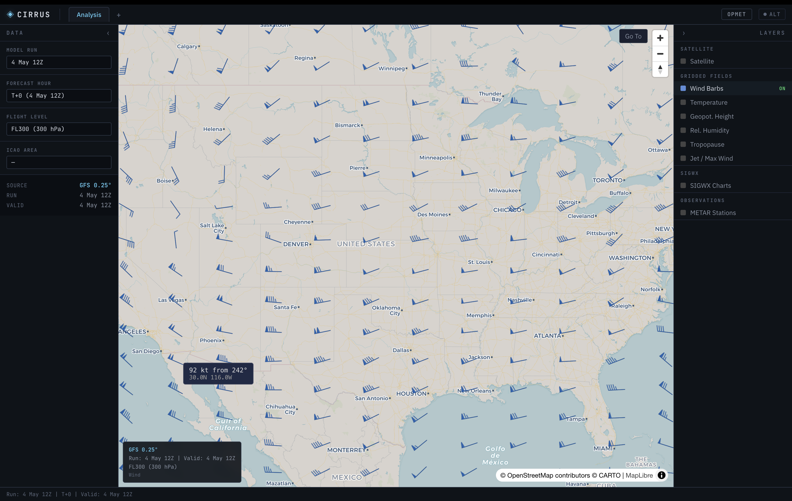
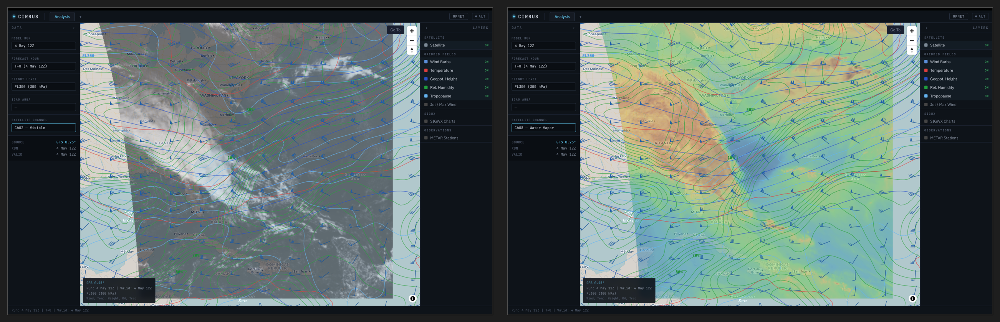
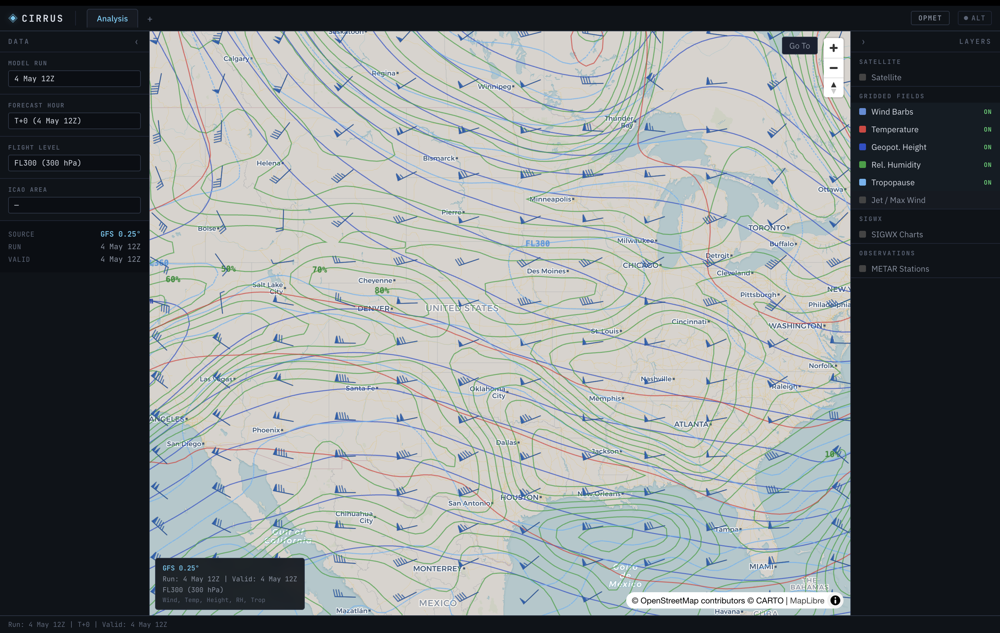

# Cirrus

> Web-first meteorological workstation

A comprehensive web-first meteorological workstation. Ingests gridded numerical-weather-prediction output, satellite imagery, station observations, and forecast advisories, decodes them locally, and renders the result as an interactive WebGL workstation — running fully offline post-ingest.

## Why build a meteorological workstation

I spent a significant portion of my career working in weather, first as a consultant for NOAA and NASA initiatives, then supporting the commercial weather products division of one of my earlier employers. I developed a passion for weather, especially aviation meteorology, and needed an outlet for the knowledge I earned over many years.

Cirrus is the means by which I scratch this itch. It allows me to maintain my footing in aviation meteorology long after my career took me elsewhere.



*Wind barbs at FL300 with hover detail. Meteorologically correct rotation, speed, direction, and position rendered on demand.*



*Visible satellite (left) and upper-level water vapor (right), each overlaid with GFS-derived gridded fields and wind barbs at flight level. The water vapor channel is the one most aviation forecasters actually care about.*



*Temperature, geopotential height, and relative humidity contours over a clean basemap. Computed in a Web Worker, rendered with d3-contour and Gaussian smoothing.*

## What it does

Cirrus pulls weather data from public sources — the GFS forecast model, GOES satellite imagery, METAR station observations, TAF and SIGMET advisories — decodes them locally, and renders the result as an interactive map you can fly through.

You see what aviation forecasters see: wind barbs at flight level, temperature and humidity contours, jet-stream isotachs, satellite imagery as the basemap, station observations with flight category, and significant-weather features rendered in standard ICAO chart style.

Everything runs on your machine. After the initial data pull, no network is required.

## What you'd see

The workstation has a left panel for selecting model run, forecast hour, flight level, and ICAO area. The map fills the center. The right panel toggles layers — satellite, gridded fields, SIGWX charts, station observations. The header has tabs for multiple analyses (you can have several open at once) and toggles for OPMET text products and altimeter settings.

Hovering a wind barb shows speed, direction, and position. Clicking a station shows its full METAR. The "Go To" control jumps the map to ICAO area presets or arbitrary coordinates.

## Architecture

Local service-oriented architecture: independent containerized services on a single host, orchestrated by Docker Compose. **Not** distributed microservices.

| Service | Language | Role |
|---|---|---|
| `acquisition` | Rust (tokio, reqwest) | Polls upstream providers (NOMADS GFS, AWC METAR/TAF/SIGMET, NOAA GOES), tracks download state, writes raw payloads |
| `decoder` | Python 3.12 + ecCodes | Decodes GRIB2 → gridded fields, IWXXM XML and BUFR → SIGWX features, GOES NetCDF → reprojected imagery |
| `backend` | Rust (Axum) | REST API serving decoded fields and imagery to the frontend |
| `frontend` | React 18 + TypeScript + MapLibre GL + Deck.gl | Operator workstation UI with WebGL map rendering. Optionally packaged as a desktop app via **Tauri**. |
| `alerting` | Rust | Will monitor for advisory products and push WebSocket alerts *(scaffold)* |
| `briefing` | Python + Playwright | Will generate PDF flight documentation *(scaffold)* |
| `monitor` | Rust | Will run service health checks *(scaffold)* |
| `postgres` | PostgreSQL 16 + PostGIS 3.4 + TimescaleDB | Single database for all data types |

Inter-service IPC is **PostgreSQL `LISTEN`/`NOTIFY`** plus shared Docker volumes for raw payloads. No message broker.

```
upstream providers  →  acquisition  →  /data/grib + /data/satellite  +  NOTIFY decoder
                                                                          ↓
                                       decoder  →  PostgreSQL  →  NOTIFY backend
                                                                          ↓
                                       backend  →  REST  →  frontend (MapLibre + Deck.gl)
```

## What's built

### Data pipelines

| Source | Cadence | Decoded into | Tables |
|---|---|---|---|
| **NOMADS GFS** GRIB2 (0.25°) | auto-poll, per cycle | UGRD/VGRD, TMP, HGT, RH, max-wind, tropopause | `grib_downloads`, `gridded_fields` |
| **AWC METAR** cache CSV | auto-poll | Station observations with flight category | `aerodromes`, `opmet_reports` |
| **AWC TAF + SIGMET** | auto-poll | OPMET text products | `opmet_text_reports` |
| **WAFS SIGWX** IWXXM XML and BUFR | manual via CLI loader | 9 phenomenon types (CB, turbulence, jets, icing, volcanic ash, etc.) | `sigwx_features` |
| **NOAA GOES-19** (East) — public S3 bucket `noaa-goes19` | auto-poll (default 600 s) | Visible (Ch2), Upper WV (Ch8), Clean IR (Ch13) reprojected to equirectangular | flat-file JSON store on `satellite_store` volume |

### Backend API

| Endpoint | Returns |
|---|---|
| `GET /api/gridded/meta` | Available runs, forecast hours, parameters, isobaric levels |
| `GET /api/gridded` | Generic gridded field by `run_time / forecast_hour / level / parameter` (optional `level_type` filter) |
| `GET /api/wind` | Paired U/V components with server-side thinning |
| `GET /api/maxwind` | Jet-stream level data for isotach contouring |
| `GET /api/sigwx` | Significant-weather features in a valid-time window |
| `GET /api/opmet/stations` | Latest METARs with flight category |
| `GET /api/opmet/text` | TAF / SIGMET text by ICAO + product type |
| `GET /api/satellite/{channel}` | Latest GOES image by channel |

### Frontend

**Workstation UI** — header bar, layer panel, data panel, status bar, ICAO area selector, map legend, station-detail popup, OPMET text panel.

**Map layers** (Deck.gl over a MapLibre basemap):

- **Wind barbs** — runtime SVG sprite atlas, meteorologically correct rotation, hover tooltip with speed (kt) / direction / position. A separate dark-green atlas is used for jet-stream barbs.
- **Temperature, height, RH contours** — computed in a Web Worker via `d3-contour` with Gaussian smoothing. **H/L extrema detection** with proximity dedup and value labels.
- **Tropopause + max wind** — isotach contour layer for jet-stream display.
- **SIGWX (significant weather)** — ICAO chart-style rendering with splines, scalloped CB boundaries, dashed boundaries, official WMO/ICAO SVG sprite atlas, and zoom-responsive symbols and labels. Renders all 9 phenomenon types.
- **Station observations** — WMO station model with cloud cover, wind barbs, sea-level pressure, and zoom scaling. Flight-category color coding.
- **GOES satellite imagery** — bilinear reprojection, semi-transparent overlay tuned for coastline visibility.

**Geographic helpers** — Go To location (center+zoom or fit-bounds), ICAO area presets, map legend overlay.

**Desktop packaging** — `services/frontend/src-tauri/` contains a Tauri wrapper for shipping the UI as a native desktop app.

### Database

Six migrations: `001_init.sql`, `002_gridded_data.sql`, `003_opmet_data.sql`, `004_add_slp.sql`, `005_sigwx_features.sql`, `006_opmet_text.sql`. TimescaleDB hypertable for `gridded_fields`. PostGIS used for SIGWX feature geometry. Aerodrome metadata seeded from OurAirports.

### Working stack

All 8 services come up cleanly under `docker compose up`. Health checks pass; `nginx` proxies `/api/*` to the backend so the SPA and API run on a single origin. End-to-end verified: a fresh `up` ingests one GFS cycle plus several hundred TAFs and SIGMETs within the first poll loop.

## Roadmap

The completed slices:

1. ✅ Stack scaffold + healthchecks
2. ✅ GFS acquisition pipeline (NOMADS)
3. ✅ GRIB2 decoder + storage
4. ✅ Wind barb visualization (end-to-end)
5. ✅ Temperature / height / RH contours with H/L extrema
6. ✅ Tropopause + max wind / jet-stream display
7. ✅ Station observations (METAR) with WMO station model
8. ✅ OPMET text products (TAF + SIGMET)
9. ✅ SIGWX rendering — IWXXM XML and BUFR, ICAO-standard symbology, scalloped CB, splines
10. ✅ GOES-19 satellite imagery (visible, upper WV, clean IR) — auto-poll from public NOAA S3 bucket
11. ✅ Workstation UI (header + layer panel + data panel + map legend)
12. ✅ Tauri desktop wrapper

Next up:

- **Auto-ingest for SIGWX** — wrap the existing CLI loader behind an acquisition polling loop or NOTIFY-driven trigger so SIGWX populates without manual operator action.
- **Alerting WebSocket channel** — push advisory products to the frontend in near-real-time (currently the `alerting` service is a scaffold).
- **PDF briefing output** — wire up Playwright to render briefing packets from the same data the UI sees.
- **Multi-provider acquisition** with primary/fallback failover, gated on credentials for authenticated upstreams.
- **Live BUFR ingest path** for SIGWX (the parser exists; the acquisition+notify wiring does not).
- **Security hardening pass** — `tower_http` security-header layer, nginx CSP, non-root containers, Docker `secrets:` blocks, URL redaction in acquisition logs.
- **Observability** — structured logging, error reporting from backend handlers, container metrics for `monitor`.
- **Compliance and conformance hardening** against published reference standards.
- **Test coverage** — integration tests for the full acquisition→decoder→backend path; visual regression for SIGWX and station-model rendering.

## Security notes and known gaps

### Hardening required before authenticated upstreams

A pre-LaCie security audit (May 2026) flagged two patterns that are safe **today** because all current upstreams are public, but will leak credentials the moment any authenticated provider is wired in:

- `services/acquisition/src/nomads.rs` logs the **full upstream URL** on every retry/error. Add a `redact_url()` helper before wiring auth.
- `services/acquisition/src/db.rs` **persists the full URL** in `grib_downloads.source_url`. Strip query string before insert.

### Hardening required before non-localhost deploy

- Backend binds `0.0.0.0:8080` with **no authentication** — fine for single-host on-prem, risky on a hostile network.
- No security headers on Axum responses or the frontend's nginx config (no CSP, `X-Frame-Options`, `nosniff`).
- All container images run as **root** — no `USER` directives in any Dockerfile.
- Compose passes secrets via `environment:` rather than Docker `secrets:` blocks.
- `.gitignore` covers bare `.env` only; should widen to `.env*` plus key/cert globs.

### Functional gaps

- **SIGWX is not auto-ingested** — features land in the DB only when an operator runs the CLI loader against a WAFS XML or BUFR file.
- **No WebSocket push channel yet** — `alerting` is a scaffold; advisory delivery is still poll-based via REST.
- **No PDF briefing output** — `briefing` is a scaffold; Playwright integration is future work.
- **No auth, no user accounts, no session management.**
- **No multi-provider failover state machine** — acquisition has retry-with-backoff per provider, but no orchestrated primary/fallback yet.
- **SIGWX BUFR parsing is fixture-tested only** — it has unit coverage against an NWS sample but has not yet been exercised against a live BUFR stream.
- Backend handlers map sqlx errors to bare 500s **without server-side logging**, so DB failures are operationally invisible.

## Repository layout

```
cirrus/
├── docker-compose.yml          # 8-service stack
├── .env.example                # Environment template (rotate password before non-local)
├── db/
│   ├── Dockerfile              # Postgres 16 + PostGIS + TimescaleDB image
│   └── migrations/             # 001 → 006, run by postgres entrypoint
├── services/
│   ├── Cargo.toml              # Rust workspace
│   ├── Dockerfile.rust         # Shared multi-stage Dockerfile (parameterized by SERVICE arg)
│   ├── acquisition/            # GFS poller, METAR/TAF/SIGMET ingest, GOES fetcher
│   ├── backend/                # Axum REST API (wind, gridded, maxwind, sigwx, opmet, satellite)
│   ├── alerting/               # Scaffold
│   ├── monitor/                # Scaffold
│   ├── decoder/                # GRIB2 + IWXXM XML + SIGWX BUFR + GOES NetCDF
│   ├── briefing/               # Scaffold
│   └── frontend/
│       ├── src/                # React + MapLibre + Deck.gl workstation UI
│       └── src-tauri/          # Tauri desktop wrapper
└── docs/                       # Spec corpus + validation guide
```

## Running Cirrus

For prerequisites, initial setup, verification, troubleshooting, and per-service development commands, see [RUNNING.md](RUNNING.md).

## Contributing

See [CLAUDE.md](CLAUDE.md) for conventions, build/test commands, and the canonical service-name vocabulary. Spec docs in `docs/` are authoritative for product requirements.
